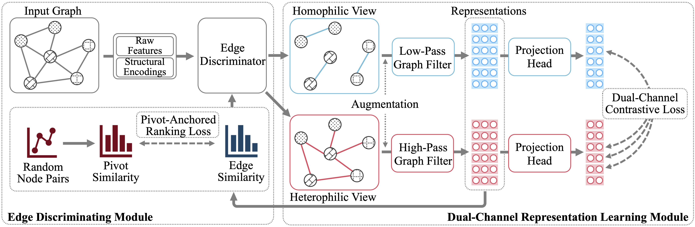

# GREET
This is the source code of AAAI'23 paper "Beyond Smoothing: Unsupervised Graph Representation Learning with Edge Heterophily Discriminating".



## Requirements
This code requires the following:
* Python==3.9
* Pytorch==1.11.0
* Pytorch Geometric==2.0.4
* DGL==0.8.0
* Numpy==1.21.2
* Scikit-learn==1.0.2
* Scipy==1.7.3

## Usage
Just run the script corresponding to the dataset you want. For instance:

```
bash script/run_cora.sh
```
